# Karoline Silva

**Software Engineer** · Arquitetura e entrega end-to-end de produtos Web e Mobile

Trabalho do levantamento de requisitos ao deploy: APIs e microsserviços, interfaces
web de alta performance, aplicações mobile multiplataforma e orquestração de
agentes de IA integrados ao produto.

---

## Projetos

### [Cadência](https://github.com/KarolineCodes/cadencia) · monorepo TypeScript

Plataforma de estudo para escolas de idiomas, com área do aluno e painel do
professor. O **mesmo módulo de agendamento roda no navegador e no servidor**,
então a tela responde na hora e os dois não têm como divergir.

Repetição espaçada adaptada ao calendário da escola, nivelamento que converge em
oito perguntas, correção de redação e conversação com IA que cita o trecho exato
e é verificada contra o texto. Autenticação com rotação de token e detecção de
reúso, autorização por recurso, 356 testes mais 138 de integração contra
Postgres real.

O app móvel vive em [cadencia-app](https://github.com/KarolineCodes/cadencia-app).

### [Copiloto de Atendimento](https://github.com/KarolineCodes/copiloto-atendimento) · IA + engenharia

Painel de analytics onde o modelo **nunca vê os dados brutos e nunca calcula**.
Ele chama ferramentas tipadas, o código computa, o modelo narra, o que elimina
a classe de erro mais comum em produto com LLM: número inventado com confiança.

Provedores Anthropic, OpenAI e simulado; roda por completo sem chave de API.

### [emaildispatch](https://github.com/KarolineCodes/emaildispatch) · infraestrutura em Go

Disparo de e-mail em massa com IP e DKIM próprios. Arquitetura hexagonal e
**zero dependências externas no núcleo**: o `go.mod` de desenvolvimento não tem
bloco `require`. Multi-cliente, com aquecimento de IP progressivo.

### [Caderneta](https://github.com/KarolineCodes/Caderneta-Flutter) · Flutter offline-first

Controle de fiado para pequeno comércio. SQLite é a fonte da verdade, não um
cache: escrita local e fila de envio na **mesma transação**, e lançamento é fato
imutável, o que torna a sincronização entre aparelhos uma união de conjuntos em
vez de um merge de dinheiro.

### [Painel MF](https://github.com/KarolineCodes/painel-mf) · micro frontends

Painel de atendimento com Module Federation. Quatro barreiras de isolamento
garantem que um módulo remoto fora do ar não derrube o resto da aplicação.

### [Maré UI](https://github.com/KarolineCodes/Mare-UI-Storybook) · design system

Biblioteca de componentes com arquitetura de tokens em duas camadas, 15
componentes acessíveis e Storybook publicado.

---

## Stack

**Linguagens**

**Frontend**

**Mobile**

**Backend**

**Dados**

**IA**

**Infra**

---

